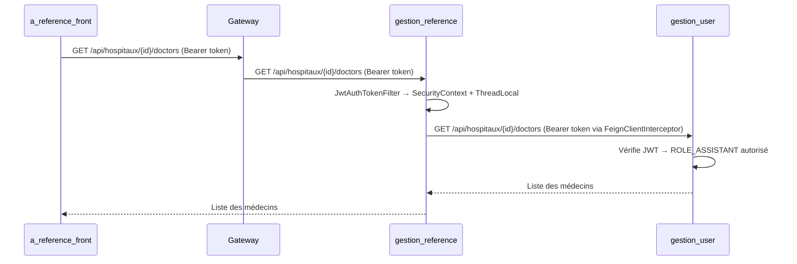

# Design Document

## Overview

Ce document décrit la solution technique pour deux problèmes liés à l'accès de l'assistant social dans le module de référencement PVVIH :

1. **Problème de propagation JWT** : Quand `gestion_reference` appelle `gestion_user` via Feign pour charger les médecins d'un hôpital (`GET /api/hospitaux/{id}/doctors`), le `FeignClientInterceptor` ne trouve pas toujours le token JWT dans le `RequestContextHolder`. Résultat : `gestion_user` reçoit une requête sans `Authorization` → 401 → le frontend redirige vers la page de connexion.

2. **Visibilité des références pour l'assistant** : Le backend `ReferenceDossierService` gère déjà les cas ASSISTANT dans `getReferencesEnvoyees()` et `getReferencesRecues()`. Le frontend (`App.js`, `Header.js`) affiche déjà les sections "dossier-sent" et "dossier-received" sans restriction de rôle. Les décomptes sont aussi déjà appelés. Le problème est donc principalement côté backend (propagation JWT) et potentiellement dans la robustesse du filtrage assistant.

## Architecture



## Components and Interfaces

### Fix 1 — FeignClientInterceptor (gestion_reference)

**Fichier** : `gestion_reference/src/main/java/sn/uasz/referencement_PVVIH/config/FeignClientInterceptor.java`

**Problème actuel** : Le `RequestContextHolder` peut être vide dans certains contextes (threads Feign, contextes async). Dans ce cas, `authHeader` est null et le token n'est pas propagé.

**Solution** : Ajouter un fallback vers le `ThreadLocal` `CURRENT_TOKEN` défini dans `JwtAuthTokenFilter` (package `config`). Ce `ThreadLocal` est alimenté par le filtre HTTP avant chaque requête.

```java
@Override
public void apply(RequestTemplate template) {
    // 1. Essayer RequestContextHolder (contexte HTTP normal)
    ServletRequestAttributes attributes =
            (ServletRequestAttributes) RequestContextHolder.getRequestAttributes();

    if (attributes != null) {
        String authHeader = attributes.getRequest().getHeader("Authorization");
        if (authHeader != null && authHeader.startsWith("Bearer ")) {
            template.header("Authorization", authHeader);
            return;
        }
    }

    // 2. Fallback : ThreadLocal stocké par JwtAuthTokenFilter
    String token = sn.uasz.referencement_PVVIH.config.JwtAuthTokenFilter.CURRENT_TOKEN.get();
    if (token != null && !token.isBlank()) {
        template.header("Authorization", "Bearer " + token);
    }
}
```

### Fix 2 — JwtAuthTokenFilter (gestion_reference/config)

**Fichier** : `gestion_reference/src/main/java/sn/uasz/referencement_PVVIH/config/JwtAuthTokenFilter.java`

**Problème actuel** : Ce filtre stocke le token dans `CURRENT_TOKEN` mais ne positionne pas le `SecurityContext`. C'est le filtre dans `security/JwtAuthTokenFilter.java` qui le fait. Les deux filtres coexistent mais seul celui du package `security` est enregistré dans la `SecurityFilterChain`. Le `CURRENT_TOKEN` est donc bien alimenté par le filtre `config`, mais ce filtre n'est pas celui utilisé par Spring Security.

**Vérification** : Dans `SecurityConfig`, c'est `sn.uasz.referencement_PVVIH.security.JwtAuthTokenFilter` qui est injecté. Le filtre `config/JwtAuthTokenFilter` n'est pas un `@Component` et n'est pas enregistré. Il faut donc s'assurer que le `CURRENT_TOKEN` est alimenté par le bon filtre.

**Solution** : Déplacer le stockage `CURRENT_TOKEN` dans `security/JwtAuthTokenFilter` (celui qui est réellement utilisé), ou faire en sorte que `security/JwtAuthTokenFilter` alimente aussi le `ThreadLocal` de `config/JwtAuthTokenFilter`.

### Fix 3 — HopitalController dans gestion_user

**Fichier** : `gestion_user/src/main/java/sn/uasz/User_API_PVVIH/controllers/HopitalController.java`

**Vérification** : L'endpoint `GET /api/hospitaux/{id}/doctors` est protégé par `@PreAuthorize("isAuthenticated()")`. Le rôle `ASSISTANT` est authentifié → devrait passer. Pas de modification nécessaire ici si le token est bien propagé.

### Fix 4 — ReferenceDossierService : robustesse du filtrage assistant

**Fichier** : `gestion_reference/src/main/java/sn/uasz/referencement_PVVIH/services/ReferenceDossierService.java`

La logique de filtrage pour l'assistant dans `getReferencesEnvoyees()` et `getReferencesRecues()` repose sur `patient.getDoctorCreate()`. Si le patient n'est pas synchronisé localement avec son `doctorCreate`, le filtre retourne `false` silencieusement. C'est le comportement attendu (Req 2.3), mais il faut s'assurer que la synchro est tentée.

La méthode `referenceServiceHelper.findPatientByCode()` fait déjà un fallback vers `DataSyncService`. Pas de modification nécessaire ici.

### Fix 5 — countReferencesDossierRecuesNonLues pour l'assistant

**Fichier** : `gestion_reference/src/main/java/sn/uasz/referencement_PVVIH/services/ReferenceDossierService.java`

`countReferencesDossierEnvoyees()` gère déjà le cas ASSISTANT correctement.

`countReferencesDossierRecuesNonLues()` en revanche retourne `0` immédiatement si l'utilisateur n'est pas un médecin (`currentDoctor.isEmpty()`). Il faut ajouter le cas ASSISTANT avec la même logique de filtrage par hôpital que dans `getReferencesRecues()` :

```java
public long countReferencesDossierRecuesNonLues() {
    // Cas 1: médecin
    Optional<Doctor> currentDoctor = getAuthenticatedDoctor();
    if (currentDoctor.isPresent()) {
        Doctor doctor = currentDoctor.get();
        return referenceDossierRepository.findByCodeDocteur(doctor.getCodeDoctor())
                .stream()
                .filter(ref -> Boolean.TRUE.equals(ref.getValidation()))
                .filter(ref -> ref.getEtat() != null && !ref.getEtat())
                .count();
    }

    // Cas 2: assistant
    Optional<AssistantSocialDto> currentAssistant = getAuthenticatedAssistant();
    if (currentAssistant.isPresent()) {
        AssistantSocialDto assistant = currentAssistant.get();
        return referenceDossierRepository.findAll().stream()
                .filter(ref -> Boolean.TRUE.equals(ref.getValidation()))
                .filter(ref -> ref.getEtat() != null && !ref.getEtat())
                .filter(ref -> {
                    try {
                        Optional<Patient> patientOpt = referenceServiceHelper.findPatientByCode(ref.getCodePatient());
                        if (patientOpt.isEmpty()) return false;
                        Doctor patientDoctor = patientOpt.get().getDoctorCreate();
                        if (patientDoctor == null) return false;
                        return patientDoctor.getHopital() != null &&
                               assistant.getHopitalId() != null &&
                               patientDoctor.getHopital().getId().equals(assistant.getHopitalId());
                    } catch (Exception e) {
                        return false;
                    }
                })
                .count();
    }

    return 0;
}

## Data Models

Aucun changement de modèle de données. Les entités existantes (`AssistantSocial`, `Doctor`, `Patient`, `ReferenceDossier`) sont suffisantes.

## Error Handling

- Si `RequestContextHolder` est vide ET `CURRENT_TOKEN` est null → le token n'est pas propagé → `gestion_user` retourne 401 → `gestion_reference` propage l'erreur → le frontend affiche "Impossible de charger les médecins" (comportement actuel conservé, mais ce cas ne devrait plus se produire après le fix).
- Si la synchro du patient échoue dans le filtrage assistant → la référence est exclue silencieusement (log WARN, pas d'exception).

## Testing Strategy

- Tester manuellement en se connectant en tant qu'assistant et en lançant `CreateReferenceSurCarte` → vérifier que la liste des médecins se charge.
- Vérifier dans les logs de `gestion_reference` que le token est bien propagé dans les appels Feign.
- Vérifier que les endpoints `/envoyees`, `/recues`, `/count/envoyees`, `/count/recues-non-lues` retournent des données filtrées correctement pour l'assistant.
