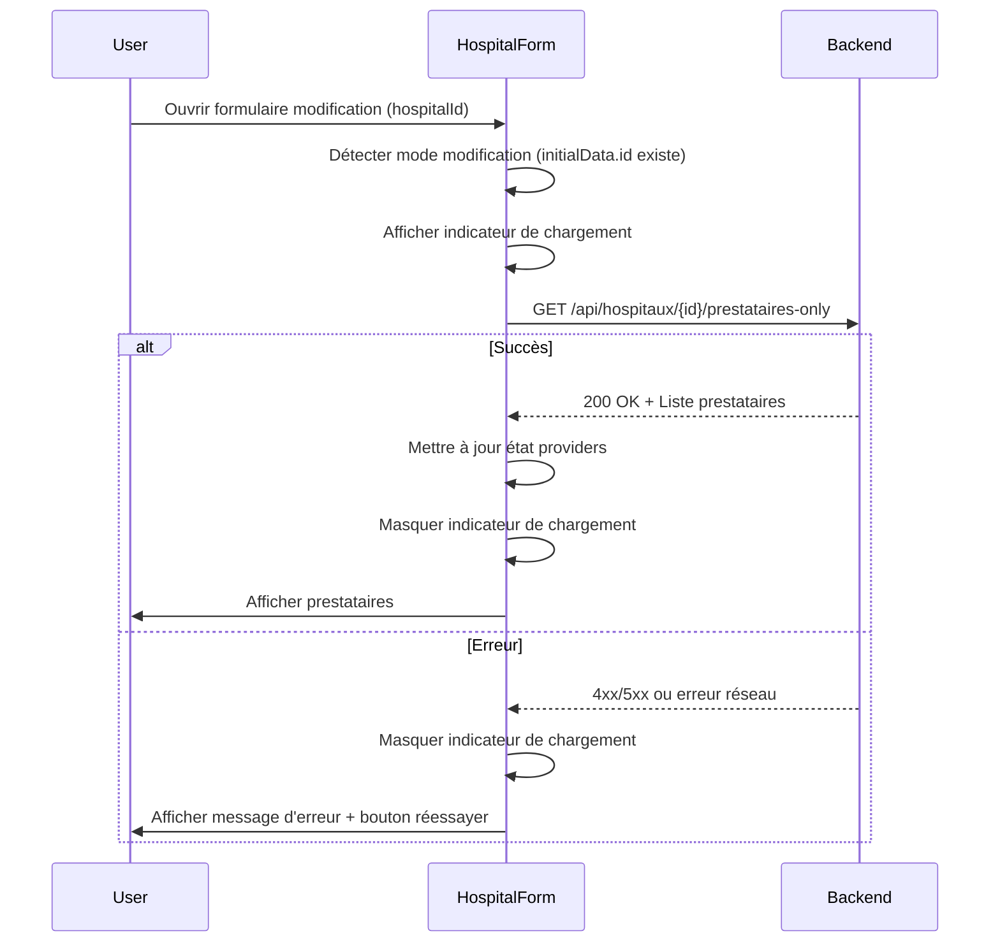

# Design Document: Fix Hospital Providers Loading

## Overview

Cette conception vise à résoudre le problème de chargement non fiable des prestataires lors de la modification d'un hôpital. Le système actuel utilise une cascade de sources de données (localStorage → initialData.prestataires → endpoint /prestataires-only) qui entraîne des incohérences et des échecs de chargement.

La solution proposée simplifie radicalement l'architecture en utilisant l'endpoint backend `/api/hospitaux/{id}/prestataires-only` comme unique source de vérité pour le mode modification, tout en supprimant complètement la dépendance au localStorage et aux données en cache.

### Principes de conception

1. **Source de vérité unique**: L'endpoint backend est la seule source de données pour les prestataires en mode modification
2. **Chargement explicite**: Les prestataires sont chargés de manière explicite et visible pour l'utilisateur
3. **Séparation des modes**: Le mode création et le mode modification ont des comportements distincts et clairs
4. **Simplicité**: Suppression de toute logique de cache et de fallback complexe
5. **Feedback utilisateur**: L'utilisateur est toujours informé de l'état du chargement (en cours, succès, erreur)

## Architecture

### Architecture actuelle (problématique)

```
┌─────────────────────────────────────────────────────────────┐
│                      HospitalForm                            │
│                                                              │
│  useEffect (initialData) ──┐                                │
│                             │                                │
│                             ├──> 1. Check localStorage       │
│                             │    (loadProvidersFromLocalStorage)
│                             │                                │
│                             ├──> 2. Check initialData.prestataires
│                             │                                │
│                             └──> 3. Call /prestataires-only  │
│                                  (async, dernier recours)    │
│                                                              │
│  Problèmes:                                                  │
│  - Cascade complexe de sources                               │
│  - localStorage peut être obsolète                           │
│  - initialData.prestataires peut être vide                   │
│  - Appel async en dernier recours arrive trop tard          │
└─────────────────────────────────────────────────────────────┘
```

### Architecture proposée (simplifiée)

```
┌─────────────────────────────────────────────────────────────┐
│                      HospitalForm                            │
│                                                              │
│  useEffect (initialData) ──┐                                │
│                             │                                │
│                             ├──> Mode création ?             │
│                             │    └──> Initialiser liste vide │
│                             │                                │
│                             └──> Mode modification ?         │
│                                  └──> Call /prestataires-only│
│                                       (source unique)        │
│                                                              │
│  Avantages:                                                  │
│  - Une seule source de vérité                                │
│  - Pas de cache obsolète                                     │
│  - Chargement explicite et visible                           │
│  - Code simplifié et maintenable                             │
└─────────────────────────────────────────────────────────────┘
```

### Flux de données



## Components and Interfaces

### 1. HospitalForm Component (modifié)

**Responsabilités:**
- Détecter le mode (création vs modification) basé sur `initialData.id`
- Charger les prestataires depuis le backend en mode modification
- Gérer l'état de chargement et les erreurs
- Afficher les indicateurs visuels appropriés

**État du composant:**

```javascript
// États existants (conservés)
const [hospital, setHospital] = useState({...});
const [selectedServices, setSelectedServices] = useState([]);
const [providers, setProviders] = useState([]);
const [currentProvider, setCurrentProvider] = useState({...});
const [message, setMessage] = useState('');

// Nouveaux états pour le chargement
const [isLoadingProviders, setIsLoadingProviders] = useState(false);
const [providersLoadError, setProvidersLoadError] = useState(null);

// États à SUPPRIMER
// const [hospitalProvidersCache, setHospitalProvidersCache] = useState({});
```

**Nouvelles fonctions:**

```javascript
// Fonction principale de chargement des prestataires
const loadProviders = async (hospitalId) => {
  setIsLoadingProviders(true);
  setProvidersLoadError(null);
  
  try {
    const gateway = process.env.REACT_APP_GATEWAY_URL || 'http://localhost:8081';
    const response = await fetch(
      `${gateway}/api/hospitaux/${hospitalId}/prestataires-only`,
      {
        method: 'GET',
        headers: {
          'Content-Type': 'application/json',
          'Authorization': `Bearer ${localStorage.getItem('token')}`
        }
      }
    );
    
    if (!response.ok) {
      throw new Error(`HTTP ${response.status}: ${response.statusText}`);
    }
    
    const data = await response.json();
    const mappedProviders = mapProvidersFromBackend(data);
    setProviders(mappedProviders);
    
  } catch (error) {
    console.error('❌ Erreur chargement prestataires:', error);
    setProvidersLoadError(error.message);
  } finally {
    setIsLoadingProviders(false);
  }
};

// Fonction de mapping des prestataires
const mapProvidersFromBackend = (backendProviders) => {
  return backendProviders.map(p => ({
    id: p.id || Date.now() + Math.random(),
    nom: p.nom || '',
    nom_prestataire: p.nom_prestataire || p.nom?.split(' ')[0] || '',
    prenom: p.prenom || p.nom?.split(' ').slice(1).join(' ') || '',
    type: p.type ? p.type.toLowerCase().replace('_', '-') : '',
    specialite: p.specialite || '',
    telephone: p.telephone || '',
    email: p.email || ''
  }));
};

// Fonction pour réessayer le chargement
const retryLoadProviders = () => {
  if (initialData?.id) {
    loadProviders(initialData.id);
  }
};
```

**useEffect modifié:**

```javascript
useEffect(() => {
  if (initialData) {
    // 1. Charger les informations de l'hôpital
    const initialHospital = {
      nom: initialData.nom || '',
      pays: initialData.pays || '',
      ville: initialData.ville || '',
      telephoneFixe: initialData.telephoneFixe || '',
      adresseComplete: initialData.adresseComplete || '',
      latitude: initialData.latitude || '',
      longitude: initialData.longitude || '',
      active: initialData.active !== undefined ? initialData.active : true,
      type: initialData.type || 'hopital'
    };
    setHospital(initialHospital);
    
    // 2. Charger les services
    if (initialData.services) {
      setSelectedServices(initialData.services.map(s => s.type || s));
    }
    
    // 3. Charger les prestataires UNIQUEMENT en mode modification
    if (initialData.id) {
      // Mode modification: charger depuis le backend
      loadProviders(initialData.id);
    } else {
      // Mode création: liste vide
      setProviders([]);
    }
    
    // 4. Configurer le préfixe téléphonique
    const country = countries.find(c => c.code === initialHospital.pays);
    if (country) {
      setPhonePrefix(country.prefix);
    }
  }
  
  setMessage('');
}, [initialData]);
```

**Fonctions à SUPPRIMER:**

```javascript
// ❌ À supprimer complètement
// const saveProvidersToLocalStorage = (hospitalId, providers) => {...}
// const loadProvidersFromLocalStorage = (hospitalId) => {...}
// const clearProvidersFromLocalStorage = (hospitalId) => {...}
```

### 2. Composant d'indicateur de chargement

**Nouveau composant pour l'étape 2 (Prestataires):**

```javascript
// Indicateur de chargement des prestataires
const ProvidersLoadingIndicator = () => (
  <Box sx={{ display: 'flex', alignItems: 'center', gap: 2, p: 2 }}>
    <CircularProgress size={24} />
    <Typography variant="body2" color="text.secondary">
      Chargement des prestataires...
    </Typography>
  </Box>
);

// Composant d'erreur avec bouton réessayer
const ProvidersLoadError = ({ error, onRetry }) => (
  <Alert 
    severity="error" 
    action={
      <Button color="inherit" size="small" onClick={onRetry}>
        Réessayer
      </Button>
    }
  >
    <Typography variant="body2">
      ❌ Erreur lors du chargement des prestataires: {error}
    </Typography>
  </Alert>
);

// Message quand aucun prestataire n'est trouvé
const NoProvidersMessage = () => (
  <Alert severity="info">
    <Typography variant="body2">
      ℹ️ Aucun prestataire associé à cet hôpital. Vous pouvez en ajouter ci-dessous.
    </Typography>
  </Alert>
);
```

### 3. Modification du rendu de l'étape 2 (Prestataires)

```javascript
case 2: // Prestataires
  return (
    <Box>
      <Typography variant="h6" gutterBottom>
        Prestataires
      </Typography>
      <Typography variant="body2" color="text.secondary" sx={{ mb: 2 }}>
        {initialData?.id 
          ? "Prestataires associés à cet établissement"
          : "Ajoutez les prestataires qui travailleront dans cet établissement"
        }
      </Typography>

      {/* Indicateur de chargement */}
      {isLoadingProviders && <ProvidersLoadingIndicator />}

      {/* Erreur de chargement */}
      {providersLoadError && !isLoadingProviders && (
        <ProvidersLoadError 
          error={providersLoadError} 
          onRetry={retryLoadProviders} 
        />
      )}

      {/* Message si aucun prestataire */}
      {!isLoadingProviders && !providersLoadError && providers.length === 0 && initialData?.id && (
        <NoProvidersMessage />
      )}

      {/* Formulaire d'ajout/modification (toujours visible) */}
      {!isLoadingProviders && (
        <Box sx={{ mb: 3, p: 2, border: '1px solid', borderColor: 'divider', borderRadius: 1 }}>
          {/* ... reste du formulaire d'ajout/modification ... */}
        </Box>
      )}

      {/* Liste des prestataires (seulement si pas en chargement) */}
      {!isLoadingProviders && (
        <Box sx={{ mt: 3, border: 1, borderColor: 'divider', borderRadius: 1, p: 2 }}>
          <Typography variant="h6" gutterBottom>
            📋 Récapitulatif des prestataires ({providers.length})
          </Typography>
          {/* ... reste de la liste ... */}
        </Box>
      )}
    </Box>
  );
```

### 4. Backend Endpoint (existant, pas de modification)

L'endpoint `/api/hospitaux/{id}/prestataires-only` existe déjà et fonctionne correctement:

```java
@PreAuthorize("isAuthenticated()")
@GetMapping("/{id}/prestataires-only")
public ResponseEntity<List<PrestataireDto>> getPrestatairesByHopitalId(@PathVariable Long id) {
    return ResponseEntity.ok(hopitalService.getPrestatairesByHopitalId(id));
}
```

**Aucune modification backend n'est nécessaire.**

## Data Models

### Provider State Model (Frontend)

```typescript
interface Provider {
  id: number | string;           // ID unique (backend ou temporaire)
  nom: string;                   // Nom complet "Prénom Nom"
  nom_prestataire: string;       // Nom de famille
  prenom: string;                // Prénom
  type: 'medecin-pec' | 'assistant-social' | 'pediatre';
  specialite: string;            // Généré automatiquement selon le type
  telephone: string;             // Optionnel
  email: string;                 // Généré automatiquement
}
```

### Backend DTO (existant, pas de modification)

```java
public class PrestataireDto {
    private Long id;
    private String nom;
    private String nom_prestataire;
    private String prenom;
    private TypePrestataire type;  // Enum: MEDECIN_PEC, ASSISTANT_SOCIAL, PEDIATRE
    private String specialite;
    private String telephone;
    private String email;
}
```

### Loading State Model

```typescript
interface LoadingState {
  isLoadingProviders: boolean;      // true pendant le chargement
  providersLoadError: string | null; // Message d'erreur ou null
}
```

## Correctness Properties

