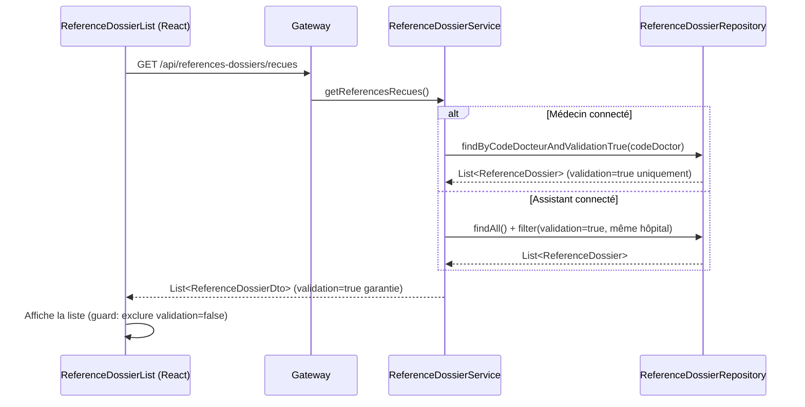

# Design Document — Filtrage des références reçues par validation

## Overview

Trois problèmes distincts sont identifiés et couverts par ce design :

**Problème 1 — Filtrage des références reçues** : Quand un assistant initie une référence, `validation=false`. Le backend filtre déjà correctement dans `getReferencesRecues()`, mais le filtrage en mémoire peut être optimisé et un guard frontend doit être ajouté.

**Problème 2 — Couleurs dans ReferenceDossierList** : La condition `reference.validation === false` utilise l'égalité stricte, ce qui ne matche pas si `validation` est `null` ou `undefined`. De même, `!reference.etat` est `true` quand `etat` est `null`, appliquant la couleur rouge à tort sur des références dont l'état n'est pas encore défini.

**Problème 3 — Nom du référenceur vide lors de la création par un assistant** : L'endpoint `/api/user/me` retourne `{ prenom, nom, username }`. Si `nom` et `prenom` sont vides en base pour l'assistant, `nomReferenceur` reste vide. Le backend tente de corriger via `patientDoctor.getUtilisateur().getNom()` mais ce champ peut aussi être null. Il faut un fallback robuste côté backend utilisant `pseudo` ou `username` du doctor.

**Corrections à apporter** :
1. Backend : ajouter `findByCodeDocteurAndValidationTrue()` dans le repository pour optimiser `getReferencesRecues()`.
2. Frontend `ReferenceDossierList` : corriger les conditions de coloration et ajouter un guard pour l'onglet "recues".
3. Backend `createReference()` : renforcer le fallback pour `nomReferenceur` quand le doctor du patient a un nom vide.

## Architecture



## Components and Interfaces

### Backend — `ReferenceDossierRepository`

Ajouter une méthode dérivée Spring Data pour récupérer directement les références validées d'un médecin destinataire :

```java
List<ReferenceDossier> findByCodeDocteurAndValidationTrue(String codeDocteur);
```

### Backend — `ReferenceDossierService.getReferencesRecues()`

Remplacer le filtrage en mémoire pour le cas médecin :

```java
// Avant
List<ReferenceDossier> references = referenceDossierRepository.findByCodeDocteur(doctor.getCodeDoctor());
return references.stream()
    .filter(ref -> Boolean.TRUE.equals(ref.getValidation()))
    ...

// Après
List<ReferenceDossier> references = referenceDossierRepository
    .findByCodeDocteurAndValidationTrue(doctor.getCodeDoctor());
return references.stream()
    .map(referenceDossierMapper::entityToDto)
    .toList();
```

### Backend — `ReferenceDossierService.createReference()` — fallback nomReferenceur

Dans le bloc assistant, après avoir récupéré `patientDoctor`, renforcer la construction du nom :

```java
// Construire le nom depuis utilisateur, puis pseudo, puis codeDoctor
String nom = "", prenom = "";
if (patientDoctor.getUtilisateur() != null) {
    nom = patientDoctor.getUtilisateur().getNom() != null ? patientDoctor.getUtilisateur().getNom().trim() : "";
    prenom = patientDoctor.getUtilisateur().getPrenom() != null ? patientDoctor.getUtilisateur().getPrenom().trim() : "";
}
String fullName = (nom + " " + prenom).trim();
if (isBlankOrUndefined(fullName)) {
    fullName = patientDoctor.getPseudo() != null && !patientDoctor.getPseudo().isBlank()
        ? patientDoctor.getPseudo()
        : patientDoctor.getCodeDoctor();
}
referenceDossierDto.setNomReferenceur(fullName);
```

### Frontend — `ReferenceDossierList.js`

**Correction des couleurs** — remplacer la logique de coloration des lignes :

```js
// Avant (problème : === false ne matche pas null/undefined)
reference.validation === false 
  ? "bg-yellow-100"
  : filterStatus === "envoyees" && !reference.etat && reference.validation === true
  ? "bg-blue-100"
  : filterStatus === "recues" && !reference.etat
  ? "bg-red-100"
  : ""

// Après (robuste : utiliser != true pour couvrir null/undefined/false)
reference.validation != true
  ? "bg-yellow-100"
  : filterStatus === "envoyees" && reference.etat !== true
  ? "bg-blue-100"
  : filterStatus === "recues" && reference.etat !== true
  ? "bg-red-100"
  : ""
```

**Guard de sécurité** dans `fetchReferences()` pour l'onglet "recues" :

```js
case 'recues':
  data = await referenceDossierService.getReferencesRecues();
  // Guard : ne jamais afficher une référence non validée dans "recues"
  data = (data || []).filter(ref => ref.validation === true);
  break;
```

## Data Models

Aucun changement de modèle de données. Le champ `validation` (Boolean) existe déjà sur `ReferenceDossier` :

| Champ | Type | Valeur à la création par assistant | Valeur après validation médecin |
|---|---|---|---|
| `validation` | Boolean | `false` | `true` |
| `etat` | Boolean | `false` | `false` (jusqu'à acceptation) |
| `statut` | String | `EN_ATTENTE` | `EN_ATTENTE` → `RECUE` |

## Error Handling

- Si le backend retourne par erreur une référence `validation=false` dans `/recues`, le guard frontend l'exclut silencieusement.
- Si `findByCodeDocteurAndValidationTrue` lève une exception, le service la propage normalement (comportement inchangé).

## Testing Strategy

- Vérifier manuellement qu'une référence créée par un assistant n'apparaît pas dans la liste "recues" du médecin destinataire avant validation.
- Vérifier qu'après validation par le médecin référenceur, la référence apparaît dans la liste "recues" du médecin destinataire.
- Vérifier que la référence `validation=false` apparaît bien dans la liste "envoyées" du médecin référenceur avec le badge "À valider".
